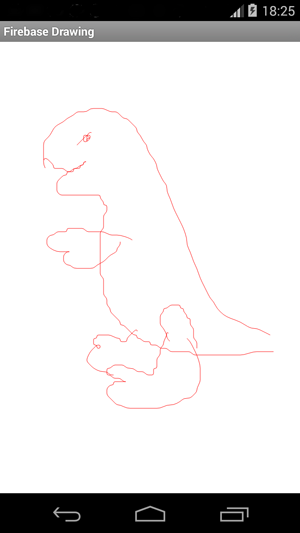

# Firebase Drawing for Android

This Android application demonstrates the use of the Firebase SDK to create a shared drawing canvas.
It also demonstrates the use of Firebase's offline and disk persistence capabilities. These ensure that
the app will continue to work even when experiencing intermittent connectivity loss and when the app
is restarted.
Multiple users can run the app and draw on the same or different canvases. Line segments are synchronized as the user draws them.

## Setup

Update [`DrawingActivity`](/app/src/main/java/com/firebase/androidchat/DrawingActivity.java) and replace
`https://android-drawing.firebaseio-demo.com` with a reference to your Firebase.

## What's here

The drawing and color-picking portions of this application are largely adapted from Google's
ApiDemo application, which was shipped with a previous version of the Android SDK's
[sample code](https://developer.android.com/samples/).

This example is intended to demonstrate how you can adapt single-user applications to be
collaborative with the help of [Firebase](https://www.firebase.com). Create your own Firebase app
and incorporate these techniques into your own application!

When you keep a board in sync, its data will be kept up to date, even while you're looking at another
board. For more information about how to use Firebase's offline capabilities in your app, see [this
section](https://www.firebase.com/docs/android/guide/offline-capabilities.html) of our
[guide for Android developers](https://www.firebase.com/docs/android/guide/).

## More about Firebase on Android

You can do lots more with Firebase on Android. Check out our Android
[Quickstart guide](https://www.firebase.com/docs/java-quickstart.html) to learn more.

